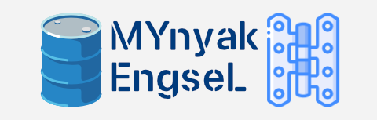

# MYnyak Engsel



CLI client for a certain Indonesian mobile internet service provider.

# How to get environtment Variables
Go to [OUR TELEGRAM CHANNEL](https://t.me/alyxcli)
Copy the provided environment variables and paste it into a text file named `.env` in the same directory as `main.py`.
You can use nano or any text editor to create the file.

# How to run with TERMUX
1. Update & Upgrade Termux
```
pkg update && pkg upgrade -y
```
2. Install Git
```
pkg install git -y
```
3. Clone this repo
```
git clone https://github.com/purplemashu/me-cli
```
4. Open the folder
```
cd me-cli
```
5. Setup
```
bash setup.sh
```
6. Run the script
```
python main.py
```

# Info

## PS for Certain Indonesian mobile internet service provider

Instead of just delisting the package from the app, ensure the user cannot purchase it.
What's the point of strong client side security when the server don't enforce it?

## Terms of Service
By using this tool, the user agrees to comply with all applicable laws and regulations and to release the developer from any and all claims arising from its use.

## Contact

contact@mashu.lol
